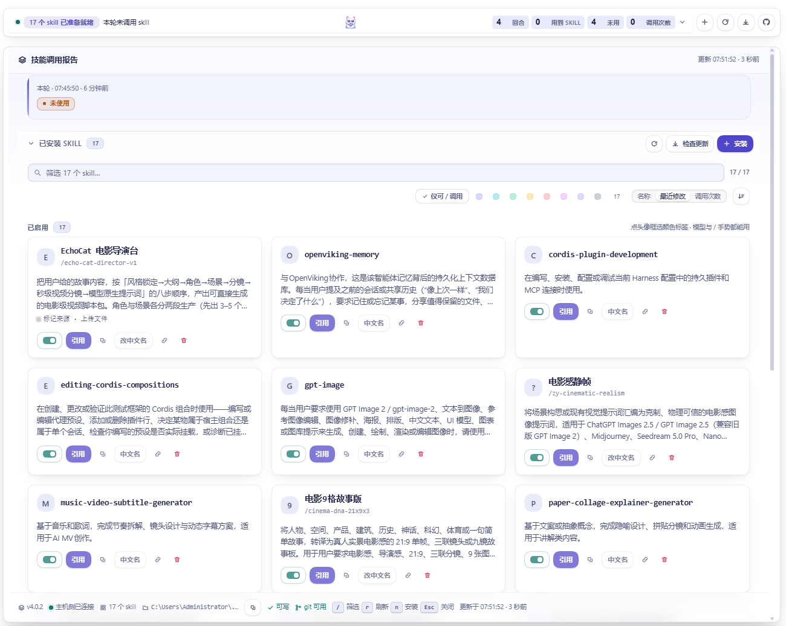
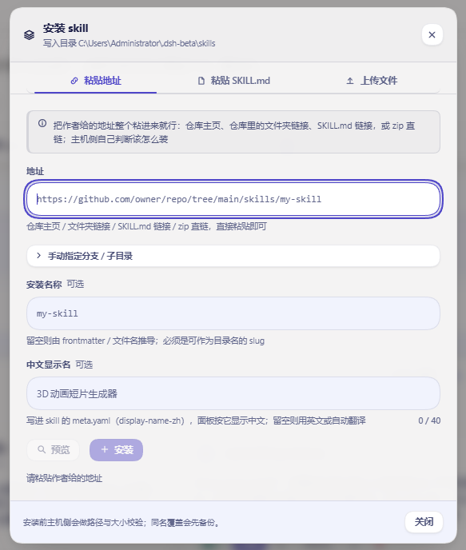

# echocat-skill-panel

**v4.1.0** · DSH Desktop Beta 的 cordis 插件：统计每轮对话用到了哪些 skill，并让你**在应用里直接装卸、更新它们**。

判定不依赖模型自觉 —— 插件从会话事件流推导本轮调了哪些 skill（模型自动、你手动 `/name`、或一个都没用），模型忘了说也照样报。



三个界面共用一份数据：

| 位置 | 说明 |
| --- | --- |
| **输入框正上方横栏** | 一行结论 + 四个计数，点开就地展开完整报告。**唯一能一键引用 skill 的界面** |
| **左栏图标** | 常驻入口，点它在中间打开面板 |
| **中栏面板** | 完整报告 + skill 目录 |

输入框上方这一条是折叠态，四个计数常驻；点它展开成完整报告，报告**单独悬浮**，不和横栏合成一个盒子：


## 一键安装

把作者给的地址**整个粘进来**就行：

```
https://github.com/owner/repo/tree/main/skills/my-skill
```

仓库主页、仓库里的文件夹链接、`SKILL.md` 链接、zip 直链、`owner/repo`、SSH 地址都认 —— host 自己判断该克隆还是该下载，分支与子目录从地址里解析，不用你填三个框。也可以上传 `.md`/`.zip`，或直接粘贴整篇 `SKILL.md`。

同名不会静默覆盖：先备份再替换。装错了能删，**删掉的进备份目录，永不硬删**。



## 装了之后能更新（4.0）

**问题**：3.0 把地址用一次就丢了（git 克隆还会被删掉）。作者发了修复，你无从判断新旧，只能删了重装 —— 而删除是移动到备份。

**做法**：安装时把来源写进该 skill 自己的 `.echocat.json`：地址、分支、子目录、**安装时的 commit**、以及一份**内容指纹**。于是：

- 卡片上多一行来源。远端有新 commit 时标成「**可更新**」，点两下即替换，**旧版本先进备份**。
- 判断只跑一次 `git ls-remote`，**不重新下载内容**；来源固定在某 commit 上时不会被误报成"有新版"。
- **你手改过这个 skill 的文件**时，确认文案会明说"更新会覆盖它们" —— 这是唯一会丢改动的场景。
- 手工装的、或 2.x/3.0 装的 skill 没有这条记录，卡片上给一个「标记来源」，填一次地址即纳入更新。
- 中文显示名不受影响：更新沿用你为该 skill 设的 `display-name-zh`。

## 界面

- **宽度跟着界面缩放**：横栏与面板的宽度由宿主自己的输入框宽度推导（`--dsh-composer-card-max-width` 减 16px），**永远比输入框窄**，并且和输入框共享同一条中轴 —— 宽窗口、窄窗口、嵌入式布局都对。
- **一套完整的设计语言**：四个表面台阶（画布 / 卡片 / 抬升 / 下沉）、一个强调色（靛蓝，只用于主操作、选中和"有东西可做"）、五级字阶（10.5 → 26px，字号越大字距越紧）、三级投影（每级两层低透明度叠加），发丝线用 `color-mix` 从墨色推导。
- **485 条具名调整**：215 项行为打磨（[polish.js](src/client/polish.js)）+ 270 项设计重做（[design.js](src/client/design.js)），全部是带名字和理由的数据记录，样式表由它们生成，测试逐条核对真的生效。
- **插件自己也能检查更新**：面板头部与横栏各有一组按钮 —— 「检查更新」问 npm 与 GitHub 谁更新（10 分钟缓存，只有点击才联网），旁边是 GitHub 发布页跳转。查到新版本时按钮带强调色和一个小圆点，头部还会直接写出「可更新 x.y.z」；"查不到"和"已是最新"是两句不同的话。
- **skill 名字一行显示全**：卡片是三行结构（名字行 / 说明 / 按钮行）。名字独占整行并且**会换行、不会被省略号截断** —— 之前它和六个按钮抢一行，长名字只剩几个字符加省略号。
- **四个计数器就在横栏那一行里**：展开横栏后，回合 / 用到 skill / 未用 / 调用次数 与结论、回合数同在一条线上，不再另起一行，也不再藏在展开的报告里。
- **每个 skill 一个开关**：停用会把目录**移出 DSH 监视的 skills 目录** —— 模型真的加载不到它，而文件一个不少，随时一键启用回来。已启用与已停用分两组列出，停用的卡片仍可改名、查来源、更新、删除。
- **深浅两套都验过**：深色盘同时挂在系统偏好与**应用内主题**两条信号上；所有文字色都按 WCAG 算过对比度（正文 18.2:1、次级 6.4:1、元数据 5.3:1）。
- `prefers-reduced-motion`、`prefers-reduced-transparency`、窄屏布局各自有覆盖。
- 改界面的做法：`node tools/preview.mjs` 渲染真实面板并截图，加 `--measure` 打印计算样式 —— **先看见，再改**。

## 一键调用

输入框正上方常驻一条横栏，点开后在 skill 卡片上按「**引用**」，`/名字 ` 就追加进草稿 —— 回车即按手动手势调用它。装完 skill 的成功提示里有同一个按钮，装完即用。

## 中文显示

中文名写进该 skill 自己的 `meta.yaml`（`display-name-zh`），面板就按中文显示。安装时能填，装完在卡片上随时能改，留空则清除。

`/名字` 手势仍然走 ASCII 代号，两者互不干扰。

## 安装

**GitHub 源码**（推荐，拿到的是完整包）：

```powershell
git clone https://github.com/VDERR/echocat-skill-panel.git
cd echocat-skill-panel
& ".\安装-3.0.ps1"      # 备份清单 → 镜像 → 清旧包名 → 建联接 → 改 manifest → pnpm install
```

**npm**（已发布到 npm，包名相同）：

```powershell
dsh plugin --profile web add echocat-skill-panel     # 走 dsh 的插件安装
npm install echocat-skill-panel                      # 或直接装进 profile 目录
```

> 两个 `peerDependencies`（`@deepseek-ai/dsh-llm`、`@deepseek-ai/schemastery`）标了 `optional`：由 DSH 运行时提供，npm 不会自己去下载一份来顶替宿主的那份。

> **装完必须重启 DSH Desktop Beta。** host 半侧在 boot 时快照进内存，而客户端 bundle 每次开页面会重新拉取 —— 所以只改客户端刷新页面就够，**改了 host 必须重启**。

脚本动手前会备份 profile 清单，`-Rollback` 一键回退。手动四步、卸载回滚，以及**五条会让应用起不来的硬性约束**都在 [安装说明.md](安装说明.md)。

## 更多

每轮结束弹一次系统原生通知；给没中文的 skill 自动翻译并缓存；深色主题；宿主不允许写入时自动变只读并说明原因；全部配置项 —— 见 [安装说明.md](安装说明.md)。

架构与实现要点、安装引擎的四条安全规矩、**宽度为什么用百分比而不是像素**、**停用为什么是"移出目录"而不是改名**、**485 条调整为什么是生成的**、**设计重做是怎么"先看见再改"的**、**来源记录为什么放在 skill 目录里**、**版本比较为什么不能拿字符串比**、**为什么"声明进了样式表"不等于"规则能命中元素"**（4.0.1 整页空白 bug 的教训）、**踩过的坑**（宿主语义令牌不能当视觉令牌用、逗号选择器不能共享组合符、`min-height:0` 会架空粘底页脚、CSS 注释里的反引号会截断样式表……），以及 1364 项断言 / 十二个门的测试明细 —— 见 [docs/设计要点.md](docs/设计要点.md)。

## 开发

```powershell
node tools/build-client.mjs        # 生成 lib/client.js（改了 src/client/ 就必须跑）
npm test                           # 九个套件
node tools/preview.mjs             # 渲染真实面板并截图（浅色 + 深色）
node tools/preview.mjs --measure   # 打印关键元素的计算样式
node tools/check-width-live.mjs    # 真 Chrome 量宽度（改了宽度规则就跑）
```

> `lib/client.js` 是**入库的构建产物**（目标机器没有工具链，`lib/` 必须一起提交）。**改了 `src/client/` 就要在同一个 commit 里重建它** —— `verify-install.mjs` 会核对 bundle 与包是否一致，漏了会在门里失败。

运行时没有任何依赖；`@deepseek-ai/dsh-llm` 与 `@deepseek-ai/schemastery` 是 host 提供的 peer。

## 许可

MIT，见 [LICENSE](LICENSE)。
